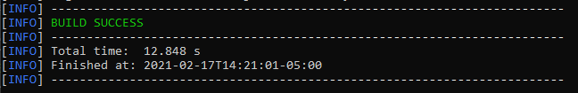
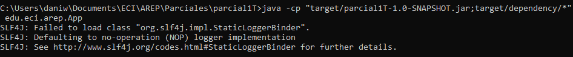
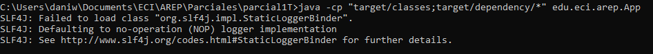
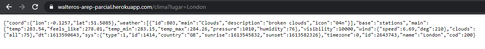
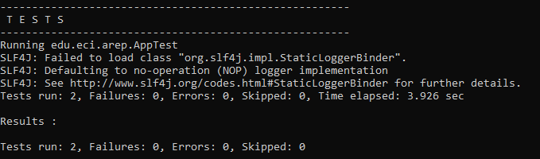
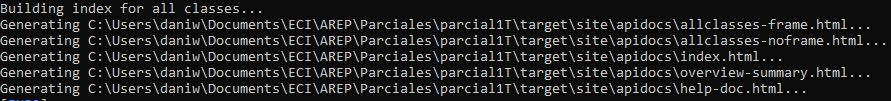

# Parcial de Primer Corte AREP

Fecha: Miércoles, 17 de Febrero del 2021

Parcial Práctico de Primer Corte de Arquitecturas Empresariales (AREP).

Su compañía lo ha seleccionado para construir un simple webservice desplegada en Heroku para uno de los clientes más importantes.

Así, han decidido que usted debe construir un webservice  para consultar el estado del clima en lugares específicos de la tierra.  El servicio web recibirá en un campo la descripción de una ciudad, por ejemplo “London” para Londres   y deberá mostrar la información del clima para esa ciudad. Para esto utilice el API gratuito de https://openweathermap.org/ (Puede crear una cuenta para obtener la llave para realizar consultas). Se le pide que su implementación sea eficiente en cuanto a recursos así que debe implementar un caché que permita evitar hacer consultas repetidas al API externo. La petición debe pasar por su servicio web desplegado en Heroku, es decir desde su servicio en Heroku se debe invocar el servicio web de clima. El usuario no sabrá qué servicio está usted invocando por detrás. Utilice el servicio "Current Weather Data".

Debe usar spark o sockets.

El servicio debe reornar un Json exactamente igual al que retorna el servicio de openweathermap denominado "Current Weather Data". Asegurese que el tipo de retorno sea Json.

## Contenido

  - [Prerrequisitos](#prerrequisitos)
  - [Compilar](#compilar)
  - [Ejecutar](#ejecutar-de-forma-local)
  - [Uso](#uso)
  - [Resultados de las Pruebas](#resultados-de-las-pruebas)
  - [Generación de Javadoc](#generación-de-javadoc)
  - [Autor](#autor)
  - [Licencia](#licencia)

## Prerrequisitos

Para el desarrollo del proyecto se utilizó **Maven** como una herramienta para la construcción y gestión del mismo, el código fue desarrollado con el lenguaje de programación **Java**; por lo tanto se requiere para su ejecución tener estas dos herramientas en las versiones especificadas a continuación.

  - Java versión 8 o superior
  
  - Maven versión 3.5 o superior 
    
## Compilar

Después de descargar o clonar el proyecto se debe utilizar el comando `mvn package` para generar el ejecutable .jar con los .class compilados.

## Ejecutar de forma local

Para utilizar el programa se debe haber realizado previamente la compilación del ejecutable .jar y de los archivos .class, una vez se haya realizado esto se usa el comando `java -cp <classpath> edu.eci.arep.App <filepath>`.

Donde `classpath` es la ruta hacia el .jar o hacia la carpeta donde se encuentran los archivos .class y `filepath` es la ruta del archivo del cual se lee el conjunto de números.

#### Ejecución con .jar

Se utilizó el comando `java -cp "target/parcial1T-1.0-SNAPSHOT.jar;target/dependency/*" edu.eci.arep.App`.

#### Ejecución con .class

Se utilizó el comando `java -cp "target/classes;target/dependency/*" edu.eci.arep.App`.

## Uso

Para hacer uso de la aplicación se debe realizar lo siguiente:

1.  Abrir la aplicación de forma local o remota y poner en la URL el nombre del lugar sobre el cual se buscará el clima.

    URL Aplicación ejecutada de forma Local: http://localhost:35000/clima?lugar=nombreDelLugar

    URL Aplicación alojada de forma Remota con Heroku: https://walteros-arep-parcial.herokuapp.com/clima?lugar=nombreDelLugar
    
    

## Resultados de las Pruebas

El programa fue probado con 2 pruebas unitarias de JUnit donde se contemplaron los siguientes casos:

  - Uso de Endpoint Generado Con Spark.
  - Fallo Por Uso Erróneo de Endpoint Generado Con Spark.

Los resultados de las pruebas se pueden visualizar al utilizar el comando `mvn package` o el comando `mvn test`.

## Generación de Javadoc

Para generar la documentación de Java se utiliza el comando `mvn javadoc:javadoc`, la documentación se almacenará en el directorio `target/site/apidocs`.

**La documentación de Java de este proyecto se encuentra previamente en la carpeta docs/apidocs**

**Adicionalmente se puede acceder a una visualización de esta documentación accediendo a este [ENLACE](https://silenrate.github.io/Parcial1-AREP/apidocs/)**

## Autor

  - **Daniel Felipe Walteros Trujillo**

## Licencia

Este proyecto está licenciado bajo la licencia **General Public License v3.0**, revise el archivo [LICENSE](LICENSE) para más detalles.
