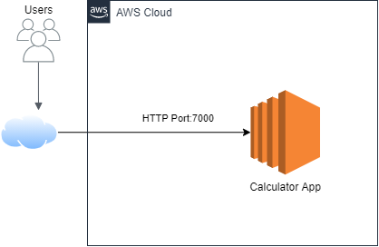

# Parcial Segundo Tercio - Ejercicios De Diseño

Fecha: Miércoles, 24 de Marzo del 2021

Segundo Parcial de Arquitecturas Empresariales (AREP).

Diseñé, construya y despliegue los siguientes servicios en un microcontenedor docker desplegado en una instancei a EC2 de AWS. Cada estudiante debe seleccionar para desarrollar dos funciones matemáticas de acuerdo a los dos últimos dígitos de su cédula como se especifica en la lista. Todas las funciones reciben un solo parámetro de tipo "Double" y retornan una prámetro sde tipo "Double".

0. log

1. ln

2. sin

3. cos

4. tan

5. acos

6. asin

7. atan

8. sqrt

9. exp (el número de euler elevado a la potencia del parámetro)

Implemente los servicios para responder al método de solicitud HTTP GET. Deben usar el nombre de la función especificado en la lista y el parámetro debe ser pasado en la variable de query con nombre "value".

Ejemplo de una llamado:

https://amazonxxx.x.xxx.x.xxx:{port}/cos?value=3.141592

Salida. El formato de la salida y la respuesta debe ser un JSON con el siguiente formato

{

 "operation": "cos",

 "input":  3.141592,

 "output":  -0.999999

}

## Contenido

  - [Prerrequisitos](#prerrequisitos)
  - [Ejecutar De Forma Local](#ejecutar-de-forma-local)
  - [Ejecutar Desde Imagen de Docker](#ejecutar-desde-Imagen-de-docker)
  - [Uso](#uso)
  - [Demo](#demo)
  - [Diagramas](#diagramas)
  - [Generación de Javadoc](#generación-de-javadoc)
  - [Autor](#autor)
  - [Licencia](#licencia)

## Prerrequisitos

Para el desarrollo del proyecto se utilizó **Maven** como una herramienta para la construcción y gestión del mismo, el código fue desarrollado con el lenguaje de programación **Java**; por lo tanto se requiere para su ejecución tener estas dos herramientas en las versiones especificadas a continuación.

  - Java versión 8 o superior
  
  - Maven versión 3.5 o superior.

## Ejecutar De Forma Local

  1. Clonar el proyecto con el comando `git clone https://github.com/Silenrate/Parcial2-AREP.git`.
  2. Compila el proyecto con el comando `mvn package`, debería obtener despues de un minuto un resultado similar a lo siguiente:

     
     
  3. Ejecutar la aplicacion con el comando java:
      
      **Windows** `java -cp target/classes;target/dependency/* edu.eci.arep.App`
      
      **Linux** `java -cp target/classes:target/dependency/* edu.eci.arep.App`
 
  4. Dirigirte a la dirección `http://localhost:4567` en tu Web Browser.

## Ejecutar Desde Imagen de Docker
   Útil para las instancias EC2 de Amazon.
   
   1. Instalar y Configurar Docker.

      Instalación en Amazon EC2: `sudo yum update -y && sudo yum install docker`.
      
      Inicio de Servicio: `sudo service docker start`.
      
      Configuración de usuario: `sudo usermod -a -G docker <usuario>` , el usuario es por defecto ec2-user.
      
      **Para estar seguro de guardar los cambios, salir y volver a entrar a la instancia**

   2. Descargar la imagen pública de DockerHub con el comando `docker pull silenrate/arepparcial2`
   3. Crear una instanacia basada en la imagen con el comando `docker run -d -p <puerto>:7000 --name <nombre> silenrate/arepparcial2` donde el nombre y el puerto son los que tu quieras.
   4. Para acceder a los logs usar el comando `docker logs -f <nombre>`.
   5. Para ver la aplicación debes dirigirte a la dirección `http://<nombre de tu instancia EC2>.amazonaws.com:<puerto>/`

## Uso

  1. Al acceder a la URL principal veras lo siguiente:
  
     
  
  3. Usando el endpoint `cos` con el parámetro value obtendrás lo siguiente:

     

  5. Usando el endpoint `sqrt` con el parámetro value obtendrás lo siguiente:

     
     
## Demo

[Link Video](https://youtu.be/T1waFp33wcI)

## Diagramas

### Diagrama de Clases

La aplicación convierte los objetos a JSON por medio del objeto Gson de Google, y calcula el coseno y la raíz por medio de la interfaz **Services**, su implementación recibe el número y retorna un objeto de tipo AppResponse; este objeto alberga el nombre de la operación, el valor de entrada y el resultado de la misma.

### Diagrama de Despliegue

El usuario se conecta por medio del internet y del protocolo HTTP al servicio que se esta ejecutando en una instancia de Amazon EC2 por el puerto 7000 (puerto por defecto de imagen de docker); una vez accede a ella ay puede calcular el coseno y la raíz cuadrada por medio de sus endpoints.

## Generación de Javadoc

Para generar la documentación de Java se utiliza el comando `mvn javadoc:javadoc` desde el directorio raíz, la documentación se almacenará en el directorio `target/site/apidocs`.

**La documentación de Java de este proyecto se encuentra previamente en la carpeta docs/javadoc**

**El Javadoc se puede acceder en este [ENLACE](https://silenrate.github.io/Parcial2-AREP/javadoc/)**

## Autor

  - **Daniel Felipe Walteros Trujillo**

## Licencia

Este proyecto está licenciado bajo la licencia **General Public License v3.0**, revise el archivo [LICENSE](LICENSE) para más detalles.
