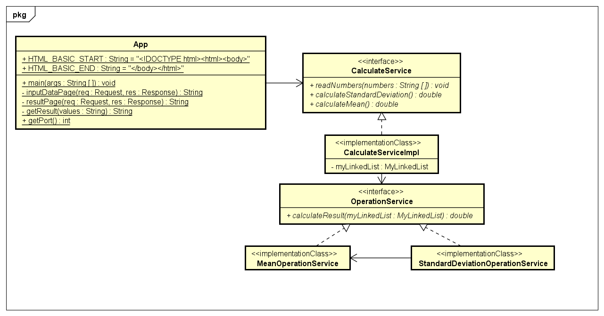

# Introducción al Diseño de Sistemas de Computadora

Fecha: Viernes, 5 de Febrero del 2021

Segundo Laboratorio de Arquitecturas Empresariales (AREP).

Desarrollar una aplicación web con Spark que calcule el promedio y la desviación estándar de un conjunto de números reales, este conjunto debe ser obtenido desde un formulario en la página web y para realizar los cálculos debe usar una Lista Encadenada (Linked List) de su propia implementación que debe ser compatible con la API de colecciones de Java.

## Contenido

  - [Prerrequisitos](#prerrequisitos)
  - [Compilar](#compilar)
  - [Ejecutar](#ejecutar-de-forma-local)
  - [Uso](#uso)
  - [Diagramas](#diagramas)
  - [Resultados de las Pruebas](#resultados-de-las-pruebas)
  - [Generación de Javadoc](#generación-de-javadoc)
  - [Documentación en PDF realizada en LATEX](#documentación-en-PDF-realizada-en-LATEX)
  - [Autor](#autor)
  - [Licencia](#licencia)

## Prerrequisitos

Para el desarrollo del proyecto se utilizó **Maven** como una herramienta para la construcción y gestión del mismo, el código fue desarrollado con el lenguaje de programación **Java**; por lo tanto se requiere para su ejecución tener estas dos herramientas en las versiones especificadas a continuación.

  - Java versión 8 o superior
  
  - Maven versión 3.5 o superior 
    
## Compilar

Después de descargar o clonar el proyecto se debe utilizar el comando `mvn package` para generar el ejecutable .jar con los .class compilados.

## Ejecutar de forma local

Para utilizar el programa se debe haber realizado previamente la compilación del ejecutable .jar y de los archivos .class, una vez se haya realizado esto se usa el comando `java -cp <classpath> edu.eci.arep.App <filepath>`.

Donde `classpath` es la ruta hacia el .jar o hacia la carpeta donde se encuentran los archivos .class y `filepath` es la ruta del archivo del cual se lee el conjunto de números.

**Para mejorar la lectura de los resultados, estos se redondearon a dos cifras decimales**

#### Ejecución con .jar

Se utilizó el comando `java -cp "target/SparkWebApp-1.0-SNAPSHOT.jar;target/dependency/*" edu.eci.arep.App`.

#### Ejecución con .class

Se utilizó el comando `java -cp "target/classes;target/dependency/*" edu.eci.arep.App`.

Después de realizar la ejecución de cualquiera de las dos formas, se accede de forma local abriendo un web browser y dirigiéndose a la dirección http://localhost:4567.

## Uso

Para hacer uso de la aplicación se debe realizar lo siguiente:

1.  Abrir la aplicación de forma local o remota y escribir números separados por coma.

    URL Aplicación ejecutada de forma Local: http://localhost:4567

    URL Aplicación alojada de forma Remota con Heroku: https://arep-lab2.herokuapp.com/
    
    

2. Hacer click en el botón `Calculate`, esto redirige a una nueva página con lo siguiente:

   

## Diagramas

El programa principal utiliza la interfaz **CalculateService** para realizar leer la información escrita en la página y para realizar las operaciones sobre la lista encadenada de implementación propia. 
La implementación de esta interfaz utiliza la interfaz **OperationService** para realizar las operaciones de forma independiente de la aplicación, lo que permite la reutilización de código en varias operaciones; un ejemplo de esto es la clase **StandardDeviationOperationService** que utiliza la clase **MeanOperationService** para calcular el promedio del conjunto de números, valor necesario para calcular la desviación estándar.

Otra ventaja de desacoplar las funcionalidades con interfaces es que en el caso de que se quieran realizar otras implementaciones de las operaciones o de los datos, basta con crear una clase que implemente la interfaz respectiva y asignarla en la clase principal **App**.

La lista encadenada de implementación propia (**MyLinkedList**) extiende la clase **AbstractSequentialList** e implementa las interfaces **List**,**Deque**,**Cloneable** y **Serializable** para ser compatible con la API de colecciones de Java, cada elemento de esta colección es representado por la clase **MyNode**, el cual posee el valor asignado y una referencia al siguiente nodo de la lista, en caso de que el siguiente nodo sea nulo, se habrá recorrido toda la colección.

Las operaciones implementadas para esta colección (además de constructor vacío) fueron listIterator, addFirst, addLast, removeFirst, removeLast y size; todas las demás funcionalidades no fueron necesarias para realizar el programa y su uso retornara la excepción **UnsupportedOperationException**.

Debido a que utilizando la herramienta Spark podemos ejecutar de forma sencilla una aplicación web, cualquier persona con conexión a internet puede acceder a la aplicación desplegada, la interacción del cliente con el servidor se realiza únicamente por el protocolo HTTP.  

## Resultados de las Pruebas

El programa fue probado con cinco pruebas unitarias de JUnit donde se contemplaron los siguientes casos:

  - Calculo del promedio con dos conjuntos de información diferentes.
  - Calculo de la desviación estándar con dos conjuntos de información diferentes.
  - Calculo del promedio y la desviación estándar desde la página web con dos conjuntos de información diferentes.

Los resultados de las pruebas se pueden visualizar al utilizar el comando `mvn package` o el comando `mvn test`.

## Generación de Javadoc

Para generar la documentación de Java se utiliza el comando `mvn javadoc:javadoc`, la documentación se almacenará en el directorio `target/site/apidocs`.

**La documentación de Java de este proyecto se encuentra previamente en la carpeta docs/apidocs**

**Adicionalmente se puede acceder a una visualización de esta documentación accediendo a este [ENLACE](https://silenrate.github.io/AREP-Lab2/apidocs/)**

## Documentación en PDF realizada en LATEX

[Introducción al Diseño de Sistemas de Computadora](IntroduccionAlDiseñoDeSistemasDeComputadora.pdf)

## Autor

  - **Daniel Felipe Walteros Trujillo**

## Licencia

Este proyecto está licenciado bajo la licencia **General Public License v3.0**, revise el archivo [LICENSE](LICENSE) para más detalles.
