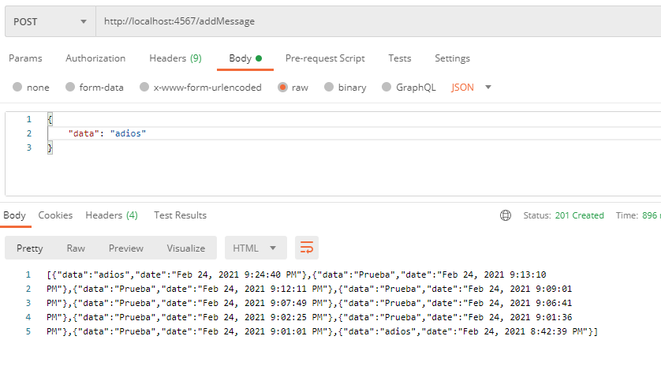
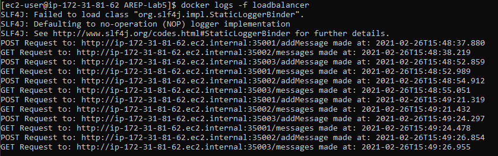

# Taller de Modularización con Virtualización e Introducción a Docker y a AWS

Fecha: Viernes, 26 de Febrero del 2021

Quinto Laboratorio de Arquitecturas Empresariales (AREP).

El taller consiste en crear una aplicación con la arquitectura descrita en la siguiente imagen usando el framework Spark y desplegarla en AWS usando una instancia de EC2 e imagenes de Docker.

* El servicio MongoDB es una instancia de MongoDB corriendo en un container de docker en una máquina virtual de EC2.
* LogService es un servicio REST que recibe una cadena, la almacena en la base de datos y responde en un objeto JSON con las 10 ultimas cadenas almacenadas en la base de datos y la fecha en que fueron almacenadas.
* La aplicación web APP-LB-RoundRobin está compuesta por un cliente web y al menos un servicio REST. El cliente web tiene un campo y un botón y cada vez que el usuario envía un mensaje, este se lo envía al servicio REST y actualiza la pantalla con la información que este le regresa en formato JSON. El servicio REST recibe la cadena e implementa un algoritmo de balanceo de cargas de Round Robin, delegando el procesamiento del mensaje y el retorno de la respuesta a cada una de las tres instancias del servicio LogService.

## Contenido

  - [Prerrequisitos](#prerrequisitos)
  - [Ejecutar](#ejecutar)
  - [Demo](#demo)
  - [Diagramas](#diagramas)
  - [Resultados de las Pruebas](#resultados-de-las-pruebas)
  - [Generación de Javadoc](#generación-de-javadoc)
  - [Documentación en PDF realizada en LATEX](#documentación-en-PDF-realizada-en-LATEX)
  - [Autor](#autor)
  - [Licencia](#licencia)

## Prerrequisitos

Para el desarrollo del proyecto se utilizó **Maven** como una herramienta para la construcción y gestión del mismo, el código fue desarrollado con el lenguaje de programación **Java**; por lo tanto se requiere para su ejecución tener estas dos herramientas en las versiones especificadas a continuación.

  - Java versión 8 o superior
  
  - Maven versión 3.5 o superior 

  - Docker versión 19 o superior

## Ejecutar

  1. Clonar el proyecto con el comando `git clone https://github.com/Silenrate/AREP-Lab5.git`.
  2. Cambiar las URL en las siguientes ubicaciones por tu IP privada.
  
     En el archivo `ClientServicesImpl.java` dentro de la ruta `RoundRobin/src/main/java/edu/eci/arep/client`:
     
     
     
     En el archivo `PersistenceServicesImpl.java` dentro de la ruta `LogService/src/main/java/edu/eci/arep/persistence`:
     
     
     
  4. Compilar las aplicaciones usando el comando `mvn package` en los directorios `LogService` y `RoundRobin`.
  5. Crear el contenedor de docker con el comando `docker-compose up -d --scale web=3`.

## Demo

## Diagramas

### Diagrama de Clases APP-LB-RoundRobin

El programa APP-LB-RoundRobin utiliza la interfaz **ClientServices** para distribuir la carga de añadir y consultar mensajes, la implementación de esta interfaz realiza por medio de una URI y una lista de puertos quemada la repartición de esta carga entre diversos nodos Log Service utilizando el algoritmo roundRobin.

### Diagrama de Clases LogService

El programa LogService utiliza la interfaz **LogServices** para agregar y consultar mensajes, la implementación de esta clase maneja las posibles excepciones y a su vez se conecta con la interfaz **PersistenceServices**, la implementación de esta otra interfaz se conecta a la base de datos MongoDB por medio de un MongoClient y consulta los ultimos diez mensajes por medio de un filtro de clase BasicDBObject.

## Resultados de las Pruebas

El programa fue probado con tres pruebas unitarias de JUnit donde se contemplaron los siguientes casos:

  - Agregar un mensaje nuevo
  - Agregar un mensaje con contenido nulo.
  - Consultar los ultimos diez mensajes.

### Prueba Manual Local

Primero se probó realizando peticiones al servicio por medio de Postman.

Después se revisaron los logs del Log Service y del Round Robin.

  * Log Service Logs:
  
    
    
  * Round Robin Logs:
  
    

### Prueba Manual En AWS

Los resultados de los logs fueron:

  * Log Service Logs:
  
    
    
  * Round Robin Logs:
  
    

## Generación de Javadoc

Para generar la documentación de Java se utiliza el comando `mvn javadoc:javadoc` en cualquiera de los directorios `LogService` y `RoundRobin`, la documentación se almacenará en el directorio `target/site/apidocs`.

**La documentación de Java de este proyecto se encuentra previamente en las carpetas javadoc de cada directorio**

**El Javadoc del directorio `LogService` se puede acceder en este [ENLACE](LogService/javadoc/)**

**El Javadoc del directorio `RoundRobin` se puede acceder en este [ENLACE](RoundRobin/javadoc/)**

## Documentación en PDF realizada en LATEX

[Taller de Modularización con Virtualización e Introducción a Docker y a AWS](TallerDeModularizacionConVirtualizacionEIntroduccionADockerYAAWS.pdf)

## Autor

  - **Daniel Felipe Walteros Trujillo**

## Licencia

Este proyecto está licenciado bajo la licencia **General Public License v3.0**, revise el archivo [LICENSE](LICENSE) para más detalles.
