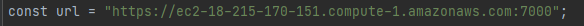
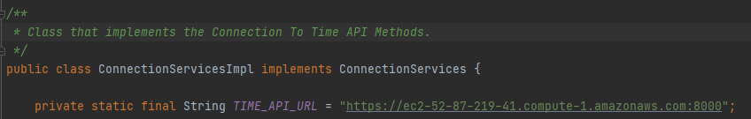
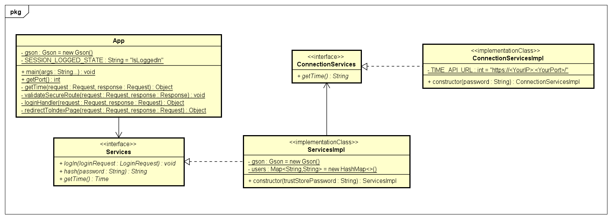
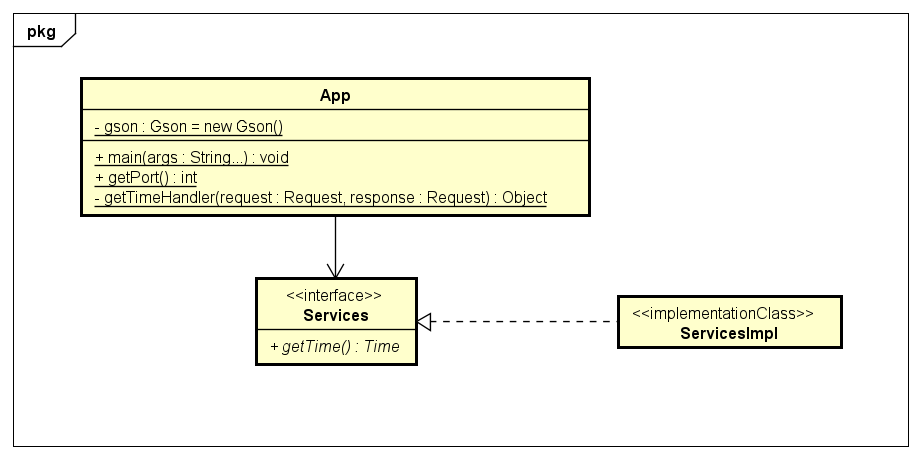
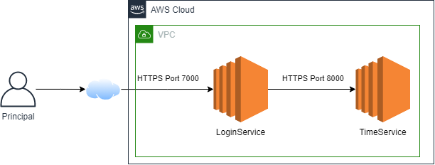

# Aplicación Distribuida Segura En Todos Sus Frentes

Fecha: Viernes, 12 de Marzo del 2021

Sexto Laboratorio de Arquitecturas Empresariales (AREP).

Desarrolle una aplicación Web segura con los siguientes requerimientos:

1. Debe permitir un acceso seguro desde el browser a la aplicación. Es decir debe garantizar autenticación, autorización e integridad de usuarios.
2. Debe tener al menos dos computadores comunicándose entre ellos y el acceso de servicios remotos debe garantizar: autenticación, autorización e integridad entre los servicios. Nadie puede invocar los servicios si no está autorizado.
3. Explique como escalaría su arquitectura de seguridad para incorporar nuevos servicios.

## Contenido

  - [Prerrequisitos](#prerrequisitos)
  - [Ejecutar](#ejecutar)
  - [Demo](#demo)
  - [Diagramas](#diagramas)
  - [Generación de Javadoc](#generación-de-javadoc)
  - [Documentación en PDF realizada en LATEX](#documentación-en-PDF-realizada-en-LATEX)
  - [Autor](#autor)
  - [Licencia](#licencia)

## Prerrequisitos

Para el desarrollo del proyecto se utilizó **Maven** como una herramienta para la construcción y gestión del mismo, el código fue desarrollado con el lenguaje de programación **Java**; por lo tanto se requiere para su ejecución tener estas dos herramientas en las versiones especificadas a continuación.

  - Java versión 8 o superior
  
  - Maven versión 3.5 o superior.

## Ejecutar

  1. Clonar el proyecto con el comando `git clone https://github.com/Silenrate/AREP-Lab6.git`.
  2. Crear tus propios pares de llaves usando keytool (esta herramineta viene por defecto con Java).
     
     **Crear Llaves** `keytool -genkeypair -alias <alias> -keyalg RSA -keysize 2048 -storetype PKCS12 -keystore <nombre de la llave> -validity 3650`
     
     Esto debe realizar para el servicio de login (alias:login, keystore:loginservice.p12) y para el servicio de tiempo (alias:time,keystore:timeservice.p12).
     
     Este comando te solicita una contraseña para acceder a las llaves, no lo olvides porque lo necesitarás mas adelante.
     
     **SOLO PARA EL SERVICIO DE TIEMPO**
     
     **Exportar certificado del par de llaves** `keytool -export -keystore timeservice.p12 -alias time -file <nombre del certificado>`
     
     **Crear Trust Store con el certificado** `keytool -import -file <nombre del certificado> -alias time -keystore myTrustStore`
     
  3. En la ruta `LoginService/keystore` debes colocar la llave del servicio de login y el trust store del servicio de tiempo.
 
  4. En la ruta `TimeService/keystore` debes colocar la llave del servicio de tiempo.
     
  5. Cambiar las URL en las siguientes ubicaciones por tu IP privada.
  
     En el los archivos `app.js` dentro de las rutas `LoginService/src/main/resources/static/js` y `LoginService/src/main/resources/static/protected` :
     
     
     
     **El puerto por defecto del servicio de Login es el 7000, si tienes una variable de entorno llamada PORT debes cambiar en la url el puerto por ese valor**
     
     En el archivo `ConnectionServicesImpl.java` dentro de la ruta `LoginService/src/main/java/edu/eci/arep/connection`:
     
     
     
     **El puerto por defecto del servicio Time es el 8000, si tienes una variable de entorno llamada PORT debes cambiar en la url el puerto por ese valor**
     
  6. Compilar las aplicaciones usando el comando `mvn package` en los directorios `LoginService` y `TimeService`.
  7. Ejecutar la aplicación del Login con el comando:
  
      **Windows** `java -cp target/classes;target/dependency/* edu.eci.arep.App <clave del keystore login> <clave del trustore time service>`
      
      **Linux** `java -cp target/classes:target/dependency/* edu.eci.arep.App <clave del keystore login> <clave del trustore time service>`
      
  8. Ejecutar la aplicación de Time Service con el comando:
  
      **Windows** `java -cp target/classes;target/dependency/* edu.eci.arep.App <clave del keystore time service>`
      
      **Linux** `java -cp target/classes:target/dependency/* edu.eci.arep.App <clave del keystore time service>`

## Demo

[Link Video](https://youtu.be/vPMGwsXQnZo)

## Diagramas

### Diagrama de Clases Login Service

El programa Login Service posee un certificado para la conexión por HTTPS, utiliza la interfaz **Services** para realizar el login con un usuario cuya contraseña esta cifrada por medio una función hash, la implementación de esta interfaz utiliza el cifrado SHA256; además esta clase consulta el tiempo actual del servidor por medio de la interfaz **ConnectionService**, la implementación de esta interfaz se conecta por medio de una URI y de una TrustStore al servicio de tiempo.

### Diagrama de Clases Time Service

El programa Time Service posee un certificado para la conexión por HTTPS y además utiliza la interfaz **Services** para consultar el tiempo actual en el servidor, la implementación de esta clase maneja las posibles excepciones y consulta el tiempo directamente.

### Diagrama de Despliegue

El usuario Principal se conecta por medio del internet y del protocolo HTTPS al servicio de Login que se esta ejecutando en una instancia de Amazon EC2 por el puerto 7000 (puerto por defecto); una vez accede a ella debe proveer credenciales para garantizar su autenticidad.

De ser efectivo el proceso de autenticación, el servicio de Login se conectará por medio de HTTPS al servicio de tiempo para informarle al Principal el tiempo actual del servidor.

Al realiza todas las conexiones por medio de HTTPS y de certificados encriptados, se garantiza la integridad y autorización del sistema.

## Generación de Javadoc

Para generar la documentación de Java se utiliza el comando `mvn javadoc:javadoc` en cualquiera de los directorios `LoginService` y `TimeService`, la documentación se almacenará en el directorio `target/site/apidocs`.

**La documentación de Java de este proyecto se encuentra previamente en las carpetas javadoc de cada directorio**

**El Javadoc del directorio `LoginService` se puede acceder en este [ENLACE](LoginService/javadoc/)**

**El Javadoc del directorio `TimeService` se puede acceder en este [ENLACE](TimeService/javadoc/)**

## Documentación en PDF realizada en LATEX

[Aplicación Distribuida Segura En Todos Sus Frentes](AplicacionDistribuidaSeguraEnTodosSusFrentes.pdf)

## Autor

  - **Daniel Felipe Walteros Trujillo**

## Licencia

Este proyecto está licenciado bajo la licencia **General Public License v3.0**, revise el archivo [LICENSE](LICENSE) para más detalles.
