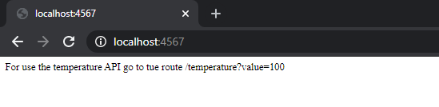
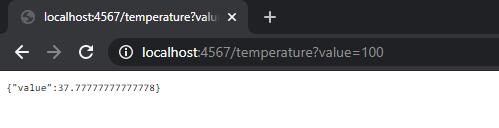
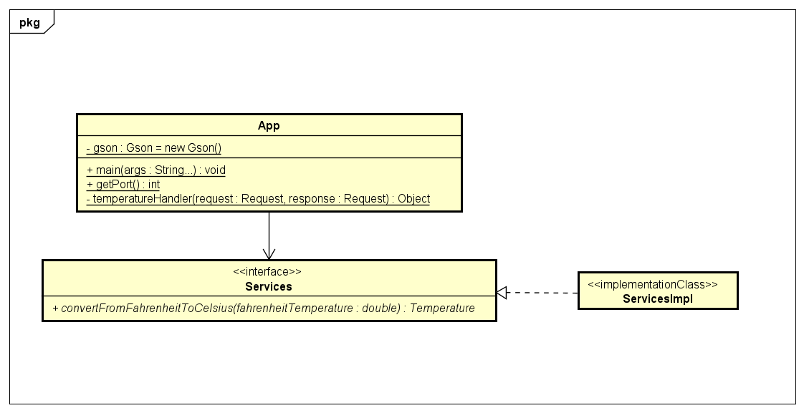
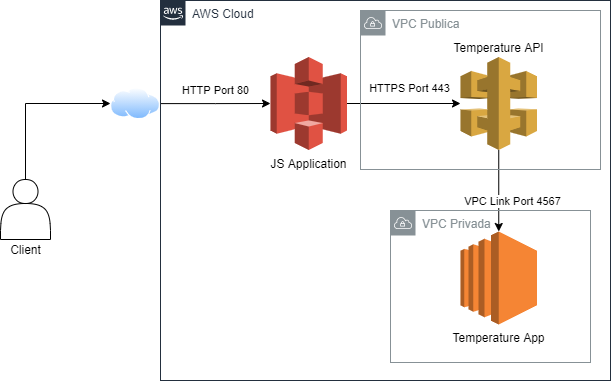
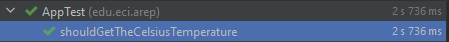
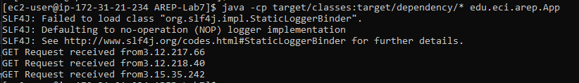
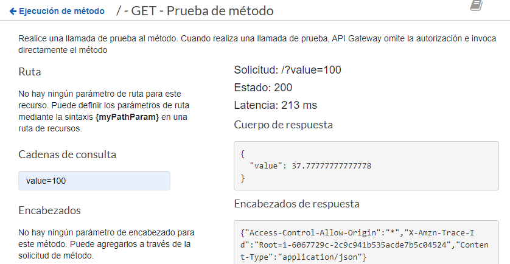
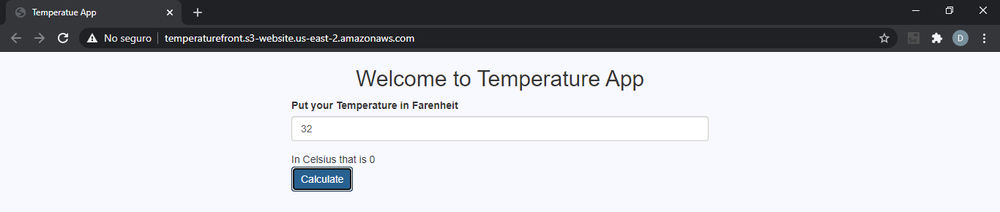

# Taller De Amazon Gateway Y Lambda

Fecha: Viernes, 2 de Abril del 2021

Séptimo Laboratorio de Arquitecturas Empresariales (AREP).

Para la Tarea usted debe:

  1. Cree un servicio Web en Spark que convierta de grados farenheit en grados celsius. El servicio debe responder un JSON.
  2. Despliegue el servicio en una máquina de AWS EC2 y publíquelo.
  3. Cree una ruta en el API getway para acceder al servicio . Ojo ya la integración no es con función lambda.
  4. Cree un aplicación JS para usar el servicio. Depliegue la aplicación en S3. Asegúrese que esté disponible sobre internet.
  5. Pruebe la aplicación Web
  6. Entregue el código desarrollado en Github, un reporte de las pruebas, y u video con el experimento funcionando.
  7. Intente que el servicio en AWS no esté accesible sobre internet, solo debe estar accesible por medio del API gateway.

## Contenido

  - [Prerrequisitos](#prerrequisitos)
  - [Ejecutar](#ejecutar)
  - [Demo](#demo)
  - [Diagramas](#diagramas)
  - [Documentación Necesaria para Realizar el Taller](#documentación-necesaria-para-realizar-el-taller)
  - [Pruebas](#pruebas)
  - [Generación de Javadoc](#generación-de-javadoc)
  - [Autor](#autor)
  - [Licencia](#licencia)

## Prerrequisitos

Para el desarrollo del proyecto se utilizó **Maven** como una herramienta para la construcción y gestión del mismo, el código fue desarrollado con el lenguaje de programación **Java**; por lo tanto se requiere para su ejecución tener estas dos herramientas en las versiones especificadas a continuación.

  - Java versión 8 o superior
  
  - Maven versión 3.5 o superior.

## Ejecutar

  1. Clonar el proyecto con el comando `git clone https://github.com/Silenrate/AREP-Lab7.git`.
  2. Compilar el proyecto con el comando `mvn package`.
  3. Dirigirte a la URL `http://localhost:<puerto>`, el puerto por defecto de la aplicación es 4567, si este no abre verifica si tienes una variable de entorno para el puerto, verás lo siguiente:

     

  5. En la URL `http://localhost:<puerto>/temperature/value=100` verás lo siguiente:

     

## Demo

[Link Video](https://youtu.be/IAyQdsvyI-E)

## Diagramas

### Diagrama de Clases

La aplicación realiza las conversiones a formato JSON por medio del objeto Gson de la librería de Google, la conversión de la temperatura lo hace por medio de su interfaz de servicios; su implementación **ServicesImpl** realiza la conversión de grados farenheit a celsius y retorna el resultado en un objeto llamado Temperature.

### Diagrama de Despliegue

El usuario se conecta por medio del internet y del protocolo HTTP por el puerto 80 a un sitio web estático de Amazon S3, este servicio no requiere región asignada; el sitio web alojado se conecta por medio de HTTPS al servicio de Amazon API Gateway expuesto al público con el CORS Habilitado. Este servicio se conecta con la aplicación desarrollada en este repositorio en una instancia EC2.

Para poder enlazar el API Gateway con la instancia EC2 sin exponer esta última al internet, se creó dentro de una VPC Privada y se conecto por medio de un VPC Link desarrollado en la consola de Amazon EC2, esto permite tener servicios desplegados que son accesibles únicamente desde la propia red de AWS.

## Documentación Necesaria para Realizar el Taller

- [Conexión Privada de API Gateway con EC2 por medio de un VPC Link](https://docs.aws.amazon.com/es_es/apigateway/latest/developerguide/getting-started-with-private-integration.html)
- [Habilitación de CORS para un recurso de una API REST](https://docs.aws.amazon.com/es_es/apigateway/latest/developerguide/how-to-cors.html)
- [Cómo crear un sitio web estático con Amazon S3](https://www.viniza.mx/como-crear-un-sitio-web-estatico-con-amazon-s3.html)
 
## Pruebas

Se realizaron varias pruebas en distintos niveles:

  1.Pruebas Unitarias del Código.

   

  3.Verificación de los logs de la instancia EC2.

   

  5.Pruebas a Nivel del API Gateway.

   

  7.Pruebas Manuales de toda la arquitectura desde S3.

   

## Generación de Javadoc

Para generar la documentación de Java se utiliza el comando `mvn javadoc:javadoc`, la documentación se almacenará en el directorio `target/site/apidocs`.

**La documentación de Java de este proyecto se encuentra previamente en la carpeta docs/javadoc**

**El Javadoc se puede acceder en este [ENLACE](https://silenrate.github.io/AREP-Lab7/javadoc/)**

## Autor

  - **Daniel Felipe Walteros Trujillo**

## Licencia

Este proyecto está licenciado bajo la licencia **General Public License v3.0**, revise el archivo [LICENSE](LICENSE) para más detalles.
