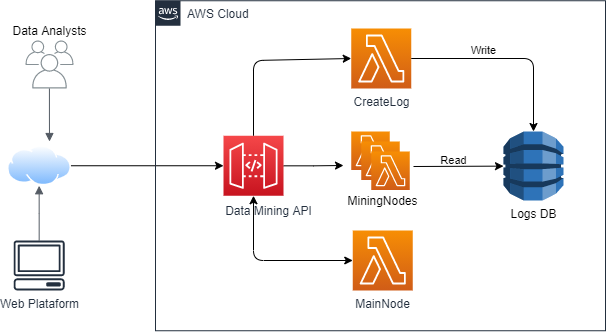
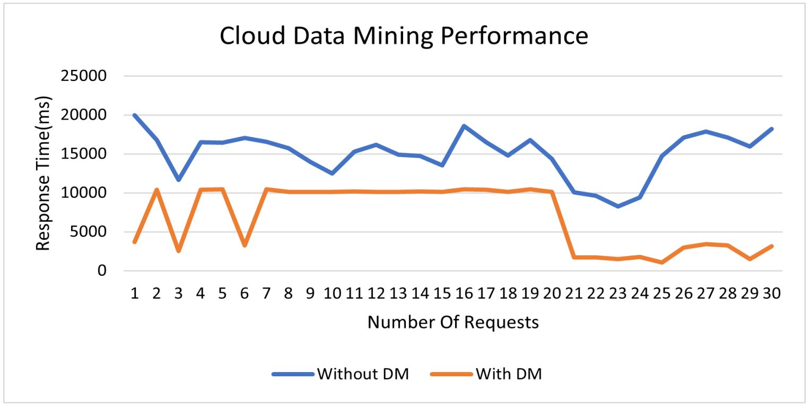

# Cloud Data Mining Computing

With the large amounts of information handled in this era, the ability to analyze it has become a problem for companies.
The use of Cloud Data Mining as a web analytics tool can help us develop digital analysis strategies for modern companies.

## How does this architecture work? 
All the access to the architecture is handled through the Amazon API Gateway Service, this service connects only to three AWS Lambda functions.

* The Create Log function is the one that allows us to store all the information of the events that we want to log inside DynamoDB, the endpoint used to access this function must be linked to the platform on which the events are going to be monitored.

* The Mining Node function reads the events stored in DynamoDB and groups them by date and type of event, converting the information into a more understandable structure suitable for web analysts.

* The Main Node function obtains the results of the events so that the company's analysts can determine modifications or creations in their market strategies based on the activity of their digital platforms; as the amount of these events is very large, the Main Node function distributes the work using the Map Reduce algorithm using instances of the Mining Node function.

To illustrate this architecture we have the next Figure.

We concluded that according to the results analyzed, with a record of at least 1000 events there was a performance of 46% with respect to the traditional approach of event processing; although this percentage is reduced to a greater amount of data, it is a very significant savings for the digital analysts of a company to better estimate their results and adapt their marketing plans.

The whole investigation is on the document on this [LINK](/Paper.pdf)

## Authors

* **Nicolás Aguilera Contreras** 
* **Nicolás Ortega Limas**
* **Daniel Felipe Walteros Trujillo**

## License

This project is under GNU General Public License - see the [LICENSE](LICENSE) file for details.
